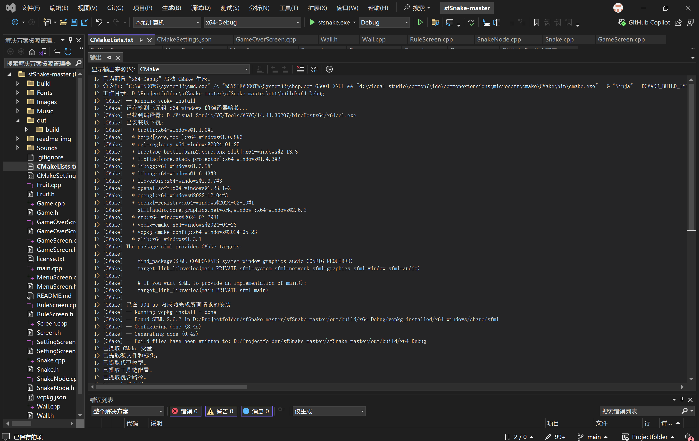

# 贪吃蛇游戏说明文档

## 一、背景介绍

本项目为基于 SFML 的贪吃蛇游戏，采用 C++ 语言开发，使用 CMake（Ninja 生成器）进行跨平台构建，开发环境为 Visual Studio 2022。
[原项目](https://github.com/jakehorsfield/sfSnake)

##### *本次任务主要实现了如下功能扩展：*

- 新增 `SettingScreen` 设置界面，可通过菜单进入，支持调整全局背景色、网格色、网格显示开关。
- 新增 `RuleScreen` 规则显示界面，可通过菜单进入，将显示游戏规则。
- 新增 `Wall` 类，增加游戏趣味性，蛇撞到墙壁将会死亡。玩家也可通过调整wall.txt个性化游戏体验。
- 贪吃蛇现在可以通过鼠标控制。按住鼠标左键，贪吃蛇将向着您的鼠标移动，松开鼠标后，贪吃蛇将自动吸附到最近的标准方向。
- 当然，`WASD`和`↑↓←→`仍然受支持。
- 网格可在 `GameScreen` 和 `SettingScreen` 中动态绘制，颜色可调。
- 游戏主循环帧率可被 `GameScreen` 中的变量动态调整。
- 代码结构采用多屏幕（Screen）管理，便于功能扩展和维护。
---
## 二、算法解释
##### 1 类关系图与用例图
这是我的项目的类关系图，具体来说有`Game` `Screen` `MenuScreen` `GameScreen` `SettingScreen` `RuleScreen` `GameOverScreen` `Snake` 
`SnakeNode` `Wall` `Fruit`这些类
分别来说，所有以"Screen"结尾的类都跟`Screen`是继承关系。另外`Snake` `Wall` `Fruit`同`GameScreen`是组合关系，`SnakeNode`同`Snake`是组合关系。

---

##### 2 核心代码与创新代码截图解释

- Game.cpp:

TPF即是屏幕的帧率，这两个函数可以允许后续的GameScreen获取并修改游戏运行的帧率。

创建一个Screen类的静态成员变量，方便后续实例化为各类Screen

main调用Game后，Game根据TPF开始循环更新静态成员变量Screen（*static std::shared_ptr<<Screen>> Screen*），满足后续的各式各类需求。

- MenuScreen.cpp:

通过Menu控制前往的界面

- SettingScreen.cpp:

值得一提的是，因为按键时长通常长于一帧，因此利用lastKeyPressed_来记录键是否已经被按下，如果已经按下，直到松开前都不会重复执行，以达到优化控制的效果。

- GameScreen.cpp:

初始化GameScreen，会同步初始化蛇身纹理，墙壁位置，计时器和计分板。

GameScreen根据SettingsScreen中的设定以及Snake、Fruit和Wall提供的数据渲染背景、网格、计分板、计时器、蛇、水果、墙

.png)
根据要求随机生成不同种类的水果，并确保不出问题

- Snake.cpp:

采用键盘鼠标兼容控制。点击鼠标时朝向鼠标方向，松开后自动吸附到标准方向

- SnakeNode.cpp:

SnakeNode采用实际形状与渲染分离的方式，实际碰撞箱用shape，渲染时用Sprite。
*蛇身最终也采用了Sprite渲染方式，原因是用Shape渲染的效果不好，容易闪烁。*

## 三 效果展示

##### 1 编译说明

项目使用SFML2.5.1版本进行构建，并且使用vcpkg库进行项目管理，若您需要在您的电脑上编译运行，需遵循以下步骤：
- 确保您的电脑上已经正确安装了VisualStudio2022以及vcpkg，并且vcpkg开启了integrate全局集成。如果没有，请在vcpkg安装目录下的命令行输入     `.\vcpkg integrate install`
- 用VisualStudio2022打开项目，确保开启了vcpkg
- 修改CmakeSettings.json中的"cmakeToolchain"项为[您的vcpkg安装路径]/scripts/buildsystems/vcpkg.cmake
- 编译项目，由于vcpkg开启了清单模式，理论上此时vcpkg会自动为您安装正确的SFML版本以及相关依赖。*第一次进行时，此过程可能耗时十分钟左右。*
- 安装完成后，您就可以正常编译运行了

##### 2 编译界面展示

##### 3 运行界面展示

Menu界面

Settings

RulePage

GamePage

GameOverPage

#### 4 视频链接
[链接](www.bilibili.com/video/BV1ZhMEzpEJr)